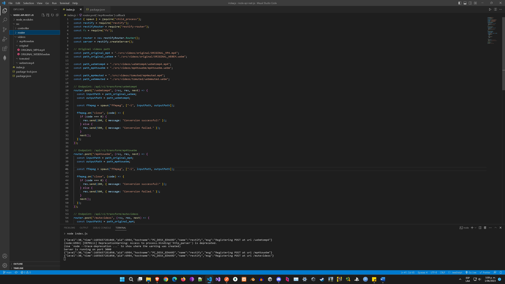

# Enter the URL for the desired endpoint, such as http://localhost:3000/api/v1/transform/webmtomp4 for the /webmtomp4 endpoint.
## Repeat the above steps to test other POST endpoints, such as /mp4towebm and /mutevideos, by changing the URL accordingly.

